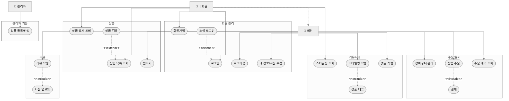

# 유즈케이스 다이어그램

```mermaid
---
config:
  flowchart:
    curve: stepAfter
  theme: neutral
  layout: fixed
---
flowchart TB
 subgraph Auth["회원 관리"]
    direction LR
        UC_Signup(["회원가입"])
        UC_Login(["로그인"])
        UC_SocialLogin(["소셜 로그인"])
        UC_Logout(["로그아웃"])
        UC_Edit(["내 정보/사진 수정"])
  end
 subgraph Product["상품"]
    direction LR
        UC_List(["상품 목록 조회"])
        UC_Detail(["상품 상세 조회"])
        UC_Search(["상품 검색"])
        UC_Wish(["찜하기"])
  end
 subgraph Order["주문/결제"]
    direction LR
        UC_Cart(["장바구니 관리"])
        UC_Order(["상품 주문"])
        UC_Pay(["결제"])
        UC_Hist(["주문 내역 조회"])
  end
 subgraph Community["커뮤니티"]
    direction LR
        UC_StyleList(["스타일링 조회"])
        UC_StyleWrite(["스타일링 작성"])
        UC_Tag(["상품 태그"])
        UC_Comment(["댓글 작성"])
  end
 subgraph Review["리뷰"]
    direction LR
        UC_ReviewWrite(["리뷰 작성"])
        UC_Photo(["사진 업로드"])
  end
 subgraph System["관리자 기능"]
        UC_Manage(["상품 등록/관리"])
  end
    Guest["👤 비회원"] -.-> Member["👤 회원 "]
    UC_SocialLogin -. &lt;&lt;extend&gt;&gt; .-> UC_Login
    UC_Search -. &lt;&lt;extend&gt;&gt; .-> UC_List
    UC_Order -. &lt;&lt;include&gt;&gt; .-> UC_Pay
    UC_StyleWrite -. &lt;&lt;include&gt;&gt; .-> UC_Tag
    UC_ReviewWrite -. &lt;&lt;include&gt;&gt; .-> UC_Photo
    Guest --> UC_Signup & UC_Login & UC_List & UC_Detail & UC_StyleList
    Member --> UC_Logout & UC_Edit & UC_Wish & UC_Cart & UC_Order & UC_Hist & UC_StyleWrite & UC_Comment & UC_ReviewWrite
    Admin["👤 관리자 "] --> UC_Manage

     UC_Signup:::ucStyle
     UC_Login:::ucStyle
     UC_SocialLogin:::ucStyle
     UC_Logout:::ucStyle
     UC_Edit:::ucStyle
     UC_List:::ucStyle
     UC_Detail:::ucStyle
     UC_Search:::ucStyle
     UC_Wish:::ucStyle
     UC_Cart:::ucStyle
     UC_Order:::ucStyle
     UC_Pay:::ucStyle
     UC_Hist:::ucStyle
     UC_StyleList:::ucStyle
     UC_StyleWrite:::ucStyle
     UC_Tag:::ucStyle
     UC_Comment:::ucStyle
     UC_ReviewWrite:::ucStyle
     UC_Photo:::ucStyle
     UC_Manage:::ucStyle
     Guest:::actorStyle
     Member:::actorStyle
     Admin:::actorStyle
```